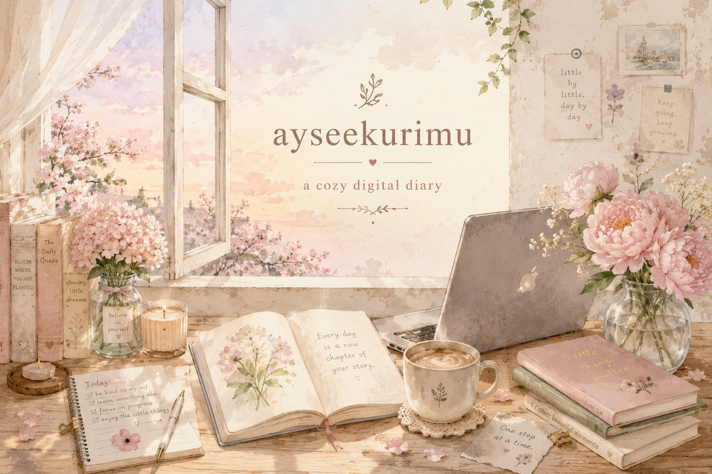

  

# ☁️ Chapter I

## 🌷 Dear Visitor

Welcome.

This isn't a portfolio made to impress.

It's a quiet place where I collect ideas,
learn through mistakes,
and grow one commit at a time.

Some chapters are complete.

Some are still waiting to be written.

Thank you for stopping by.

---

## 🌱 Currently Growing

- Learning Web Development
- Building cozy digital experiences
- Turning ideas into little projects
- Enjoying the journey more than perfection

---

## 📚 Little Chapters

> *The pages are still waiting to be written.*

> *See you again when a new chapter begins.* 🌷

---

## 🌼 Garden Journal

---

## ☕ Quiet Moments

Currently enjoying...

- Coffee
- Rain
- A peaceful playlist
- Slow progress

---

*"Every flower blooms at its own pace."* 🌸

Until next chapter.

